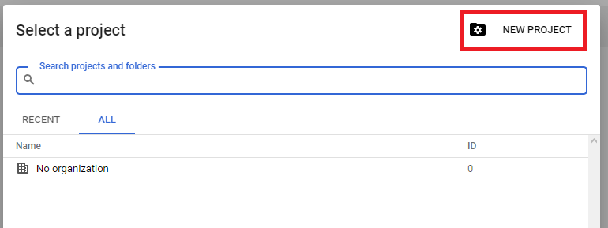
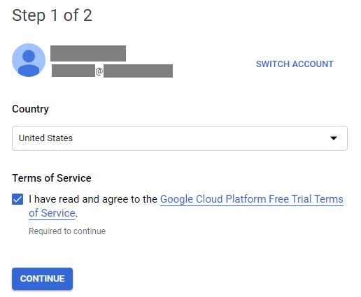
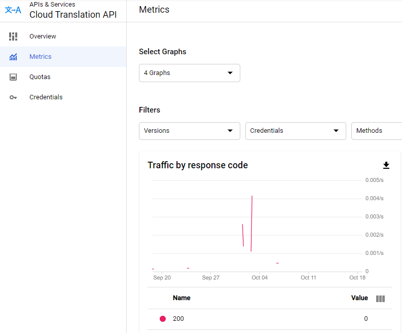

# KM AUTOMATIC TRANSLATION
 
### TABLE OF CONTENTS
* [Introduction](#introduction)
* [How does it work?](#how-does-it-work)
* [GOOGLE SERVICES](#google-services)
    * [Billing information](#billing-information)
    * [API Key](#api-key)
    * [Cloud Translation API](#cloud-translation-api)
* [Prepare your Inbenta Instances](#prepare-your-inbenta-instances)
* [Dependencies](#dependencies)
 
### Introduction
Inbenta supports [42 languages](https://www.inbenta.com/en/languages-supported/#). Multi-language implementations are very popular among our customers. One of the challenges of multi-language projects is to create and maintain contents across multiple languages. To help our customers with this problem, we have created an application to automatically translate (We have used Google Services. You could choose your choice of the translation service) and create contents across multiple language instances when you create one in your base language.
 
### How does it work?
This auto-translate application uses translation services such as Amazon Translate to create the translations. 

A webhook is created to use the Amazon Translate for translation. Multi-language instances are linked together in the settings of the base instance where the content will be created or edited. When content is saved (both new content & edit content) in the base knowledge instance, this Webhook gets triggered and that sends the content to Amazon Translate and creates respective content in other language instances based on the translated text received from Amazon. 

The following is the dynamic settings considered for translation.
* Title
* Answer text
* Alternative titles (if exists)
* Answer text for every user type (as long as the user types ID’s exist in target instance)

In addition to the translation of above-mentioned content attributes, this application also considers the data entered in other content attributes of the original content and saves them as is in all the language instances. 

Here is the list of additional content attributes considered:
* Publication date
* Expiration date
* Status
* Use for popular
* Related content
* Categories (as long as the ID exist in the target instance)
 
### GOOGLE SERVICES
* Login to your Google account through the [Developers Console](https://console.developers.google.com/).


* If you have projects previously created, choose one. If you don’t, create a new one by clicking on **Select a project** and then **NEW PROJECT**.



* Enter a **Project name** and click on **CREATE**.


 
#### Billing information
* In order to start using the Translation API, you need to provide the Billing information. Go to **Billing** located on the left-top menu.


* Click on **ADD BILLING ACCOUNT**.


* On the next screen, select the **Country**, and accept the **Terms of Service**.


* Provide the details requested in Step 2:


* Add the payment details.


#### API Key
* Once the Billing information is added, create an **API Key**. Go to **APIs & Services**, located on the left-up menu, and then to **Credentials**.


* Click on **CREATE CREDENTIALS → API key**.


* This automatically creates a new API Key.


* Restrict your new key or change the name.


#### Cloud Translation API
* The final process is to activate the Translation API. Go to  **APIs & Services → Library **


* You should see the main screen for the API Library, where you can search for the existing Google APIs services.


* Search for “translation” and click on the first result.


* Click on **ENABLE**.


* Once you have it enable, you should be able to see the metrics.



For further information visit the [Cloud Translation documentation](https://cloud.google.com/translate/docs).
___
### Prepare your Inbenta Instances

Reach out to your Inbenta Point of Contact to enable the following for you:

* **Multilanguage Related Instances** settings.
* Webhook that you create for the translation service. In your main instance go to **Settings -> Static -> On save content webhook**, (this is the ```KM_HEADER_KEY```, needed in the .env file). You will share the following details:

```env
    URL: https://automatic_translations_url.com
    Header Name: Apply-Translation
    Header Value: secretKey|en
```
>NOTE: “Header Value” is a string defined by customer, but is mandatory to add at the end a pipe character ( | ) and the language of the primary instance. Example “xxxxx|en”, “xxxxx|es”, “xxxxx|fr”, etc. For this value avoid the use of #. 
The “Header Name” must be “Apply-Translation”


* In the .env file, the following configuration needs to be added:
    * Auth URL for the KM API, given by Inbenta.
    * Header key value (previous step).
    * A "User Personal Secret Token" (```KM_UPST```). [Help Center Instructions](https://help.inbenta.com/en/general/administration/managing-credentials-for-developers/managing-your-ups-tokens/).
    * Api Key and Secret (from **Knowledge Editor API**) of every instance (origin and target instances).
    * Google information (key and url).
* Set all values in the **.env** file:
```env
AUTH_URL = 
KM_HEADER_KEY =
KM_UPST = 
KM_LANG_LIST = ES,EN
KM_API_KEY_ES = 
KM_SECRET_ES = 
KM_API_KEY_EN = 
KM_SECRET_EN = 
GOOGLE_KEY = 
GOOGLE_URL = 
```
 
### DEPENDENCIES
This application needs 2 dependencies: `guzzlehttp/guzzle` and `vlucas/phpdotenv` as a Composer dependency.
